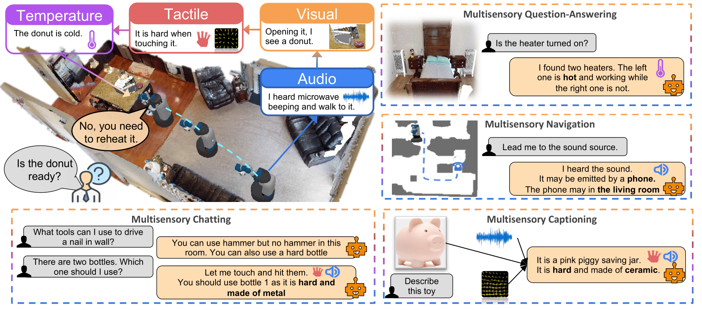
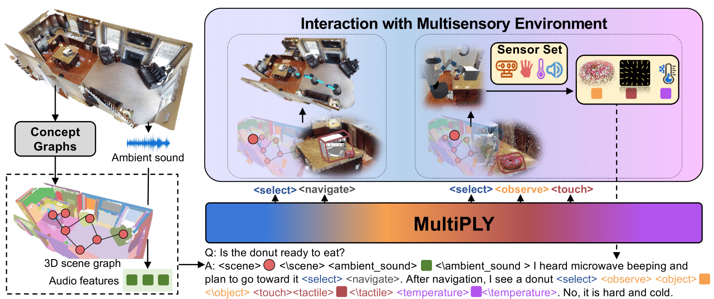

<br/>
<p align="center">
  <h1 align="center">MultiPLY: A Multisensory Object-Centric
Embodied Large Language Model in 3D World </h1>
  <p align="center">
    <a href="https://evelinehong.github.io">Yining Hong</a>,
    Zishuo Zheng,
    <a href="https://peihaochen.github.io">Peihao Chen</a>,
    <a href="https://wangyian-me.github.io/">Yian Wang</a>,
    <a href="https://senfu.github.io/">Junyan Li</a>,
    <a href="https://people.csail.mit.edu/ganchuang">Chuang Gan</a>
  </p>
  <p align="center">
    <a href='https://arxiv.org/abs/2401.08577'>
      
    </a>
    <a href='https://vis-www.cs.umass.edu/multiply/' style='padding-left: 0.5rem;'>
      
    </a>
  </p>
  <p align="center">
    
  </p>
</p>

MultiPLY is a <strong>multisensory embodied</strong> large language model that could actively interact with the objects in the 3D environment and dynamically collect their multisensory information. It could incorporate multisensory interactive data, including visual, audio, tactile, and thermal information into large language models, thereby establishing the correlation among words, actions, and perceptions.

## Method
  <p align="center">
    
  </p>

We first encode the scene as an abstracted object-centric representation, while multisensory details
of objects can only be unveiled when the agent executes an action and interacts with them. We devise a set of action tokens denoting the
actions of agents to interact with the environment. The interaction results are appended back to the LLM via state tokens

## Citation
```
@article{multiply,
 author = {Hong, Yining and Zheng, Zishuo and Chen, Peihao and Wang, Yian and Li, Junyan and Chen, Zhenfang and Gan, Chuang},
 title = {MultiPLY: A Multisensory Object-Centric Embodied Large Language Model in 3D World},
 journal = {arXiv},
 year = {2024},
} 
```
